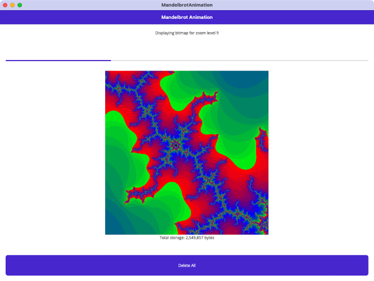

# Mandelbrot Animation

This sample demonstrates the use of SkiaSharp bitmap animations in a .NET Multi-platform App UI (.NET MAUI) app. Running the sample requires some patience because it first needs to create up to 50 bitmaps of various zoom levels of the famous Mandelbrot Set. After that's finished, however, the program animates those bitmaps to simulate a continuous zoom.

As the sample is creating the 50 bitmaps, it stores them in application local storage as PNG files. This allows the sample to access those PNG files the next time that you run the program, so you don't have to wait for them to be created. However, these 50 bitmaps occupy over 20 megabytes of storage on your device.

The *MainPage.xaml.cs* file begins with several constants that you can change:

- The `COUNT` constant indicates the number of bitmaps in the animation. It is initially set to 10, but you can set it to any value up to 50. Setting it to values beyond 50 adds very little, however, because at that zoom level the algorithm runs into problems caused by the resolution of double-precision floating point numbers.
- The `BITMAP_SIZE` constant indicates the square size of the bitmap. It is set to 1000 to create bitmaps of 1000-by-1000 pixels.
- The `center` field indicates the `Complex` point that the program zooms in on. There are three possible values in the sample,.

The bitmaps that the sample saves in local application storage incorporate the `center` value in their filenames. This means that if you run the sample with one `Complex` point, and then change `center` and run it again with another `Complex` point, the app's local storage will contain bitmaps for both points. A `Label` at the lower-left corner of the program displays the total storage space of all the bitmaps created by the sample.

At any time while the program is running, you can click the **Delete All** button in the lower-right corner of the program to delete all the bitmaps. You can even do this as the sample is animating the bitmaps, because at that point, all the bitmaps have been loaded into memory. Uninstalling the program from the device also clears the app's local storage.

When you first run the program, the `Label` at the top of the program shows which bitmap is being created. The `ProgressBar` indicates the progress of the Mandelbrot algorithm. Each successive bitmap is another level of zoom - it displays 1/2 of the width and height of a square of the complex plane as the previous bitmap. Once the sample has all the bitmaps created and loaded into memory, the `Label` and `ProgressBar` show the zoom level of the bitmap being displayed, and the degree to which that bitmap is zoomed.

> [!NOTE]
> On some devices, the animation runs smoother if the sample is not being run under control of Visual Studio's debugger.

[!INCLUDE [Install SkiaSharp](../includes/install-skiasharp.md)]
